# Design Patterns in Java

This repository is part of the [Refactoring.Guru](https://refactoring.guru/design-patterns) project.

It contains Java examples for all classic GoF design patterns.


## Requirements

The examples were written in Java 8, but also tested in Java 9.

For the best experience, we recommend working with examples in IntelliJ IDEA. The Community Edition of IDE is available for free (https://www.jetbrains.com/idea/download/).

After downloading or cloning this repository to your computer, import its root directory into a New project:

- Either through start dialog: Select "Import Project" option and skip through the rest of the steps.

- Or via the main menu: File > New > Project from Existing Sources...

After importing the project, you will be able to run examples by right-clicking "Demo" files inside every example and selecting the "Run" command from the context menu.


## Roadmap

- [ ] Add detailed comments all classes.
- [ ] Add structure-only examples.


## Contributor's Guide

We appreciate any help, whether it's a simple fix of a typo or a whole new example. Just [make a fork](https://help.github.com/articles/fork-a-repo/), do your change and submit a [pull request](https://help.github.com/articles/creating-a-pull-request-from-a-fork/).

Here's a style guide which might help you to keep your changes consistent with our code:

1. All code should meet the [Google Java Style Guide](https://google.github.io/styleguide/javaguide.html)

2. Try to hard wrap the code at 80th's character. It helps to list the code on the website without scrollbars.

3. Examples should match following package convention: refactoring_guru.{pattern}.{example_name}. Example:

    ```java
    package refactoring_guru.factory_method.ui_example.buttons;

    class Button {
    ...
    ```

4. Places classes into separate files.

5. Group classes into sub-packages. It helps people to understand dependencies of a class by glancing over its imports. Example:

    ```java
    package refactoring_guru.factory_method.example.buttons;

    class Button {
    ...
    ```

    ```java
    package refactoring_guru.factory_method.example.factories;

    import Button;

    class Factory {
    ...
    ```

6. Comments may or may not have language tags in them, such as this:

    ```java
    /**
     * EN: All products families have the same varieties (MacOS/Windows).
     *
     * This is a MacOS variant of a button.
     *
     * RU: Все семейства продуктов имеют одни и те же вариации (MacOS/Windows).
     *
     * Это вариант кнопки под MacOS.
     */
    ```

    Don't be scared and ignore the non-English part of such comments. If you want to change something in a comment like this, then do it. Even if you do it wrong, we'll tell you how to fix it during the Pull Request.


## License

This work is licensed under a Creative Commons Attribution-NonCommercial-NoDerivatives 4.0 International License.

<a rel="license" href="http://creativecommons.org/licenses/by-nc-nd/4.0/"></a>


## Credits

Authors: Bohdan Herashchenko ([@b1ger](https://github.com/b1ger)) and Alexander Shvets ([@neochief](https://github.com/neochief))


# Creational Patterns
  ## Abstract Factory

Creates an instance of several families of classes

Permite producir familias de objetos relacionados sin especificar sus clases concretas.


  

  ## Builder

Separates object construction from its representation

Permite construir objetos complejos paso a paso. Este patrón nos permite producir distintos tipos y representaciones de un objeto empleando el mismo código de construcción.

  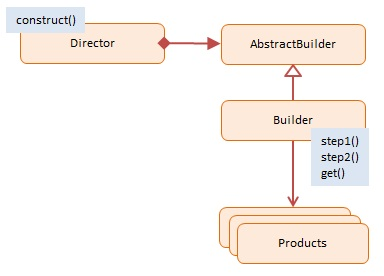

  ## Factory Method

Creates an instance of several derived classes

Proporciona una interfaz para la creación de objetos en una superclase, mientras permite a las subclases alterar el tipo de objetos que se crearán.

  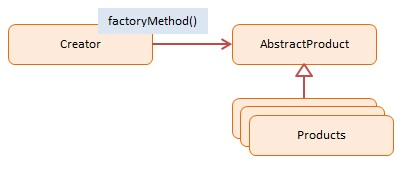

  ## Prototype

A fully initialized instance to be copied or cloned

Permite copiar objetos existentes sin que el código dependa de sus clases.

  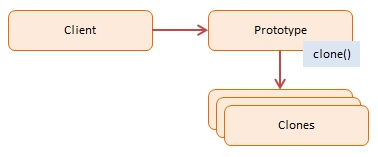

  ## Singleton

A class of which only a single instance can exist

Permite asegurarnos de que una clase tenga una única instancia, a la vez que proporciona un punto de acceso global a dicha instancia.

  

# Structural Patterns
  
  ## Adapter

Match interfaces of different classes

Permite la colaboración entre objetos con interfaces incompatibles.

  

  ## Bridge

Separates an object’s interface from its implementation

Permite dividir una clase grande o un grupo de clases estrechamente relacionadas, en dos jerarquías separadas (abstracción e implementación) que pueden desarrollarse independientemente la una de la otra.

  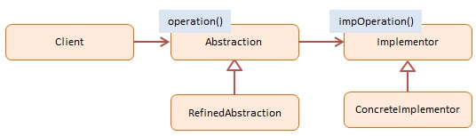

  ## Composite

A tree structure of simple and composite objects

Permite componer objetos en estructuras de árbol y trabajar con esas estructuras como si fueran objetos individuales.

  

  ## Decorator

Add responsibilities to objects dynamically

Permite añadir funcionalidades a objetos colocando estos objetos dentro de objetos encapsuladores especiales que contienen estas funcionalidades.

  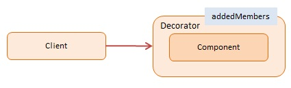

  ## Facade

A single class that represents an entire subsystem

Proporciona una interfaz simplificada a una biblioteca, un framework o cualquier otro grupo complejo de clases.

  

  ## Flyweight

A fine-grained instance used for efficient sharing

Permite mantener más objetos dentro de la cantidad disponible de memoria RAM compartiendo las partes comunes del estado entre varios objetos en lugar de mantener toda la información en cada objeto.

  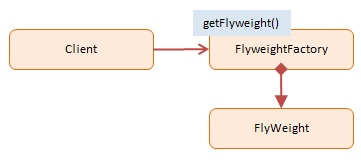

  ## Proxy

An object representing another object

Permite proporcionar un sustituto o marcador de posición para otro objeto. Un proxy controla el acceso al objeto original, permitiéndote hacer algo antes o después de que la solicitud llegue al objeto original.

  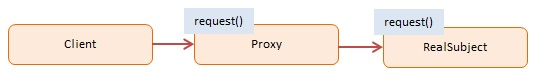


# Behavioral Patterns

  ## Chain of Responsibility

A way of passing a request between a chain of objects

Permite pasar solicitudes a lo largo de una cadena de manejadores. Al recibir una solicitud, cada manejador decide si la procesa o si la pasa al siguiente manejador de la cadena.

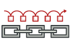  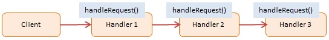

  ## Command

Encapsulate a command request as an object

Convierte una solicitud en un objeto independiente que contiene toda la información sobre la solicitud. Esta transformación te permite parametrizar los métodos con diferentes solicitudes, retrasar o poner en cola la ejecución de una solicitud y soportar operaciones que no se pueden realizar.

  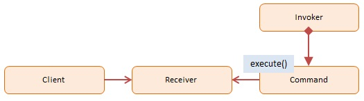

  ## Interpreter

A way to include language elements in a program

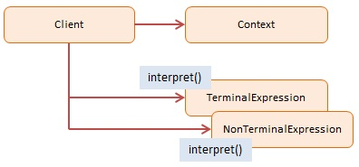

  ## Iterator

Sequentially access the elements of a collection

Permite recorrer elementos de una colección sin exponer su representación subyacente (lista, pila, árbol, etc.).

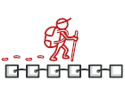  

  ## Mediator

Defines simplified communication between classes

Permite reducir las dependencias caóticas entre objetos. El patrón restringe las comunicaciones directas entre los objetos, forzándolos a colaborar únicamente a través de un objeto mediador.

  

  ## Memento

Capture and restore an object's internal state

Permite guardar y restaurar el estado previo de un objeto sin revelar los detalles de su implementación.

  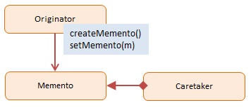

  ## Observer

A way of notifying change to a number of classes

Permite definir un mecanismo de suscripción para notificar a varios objetos sobre cualquier evento que le suceda al objeto que están observando.

  

  ## State

Alter an object's behavior when its state changes

Permite a un objeto alterar su comportamiento cuando su estado interno cambia. Parece como si el objeto cambiara su clase.

  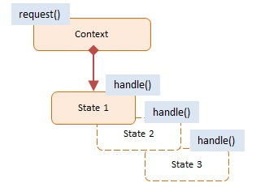

  ## Strategy

Encapsulates an algorithm inside a class

Permite definir una familia de algoritmos, colocar cada uno de ellos en una clase separada y hacer sus objetos intercambiables.

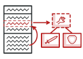  

  ## Template Method

Defer the exact steps of an algorithm to a subclass

Define el esqueleto de un algoritmo en la superclase pero permite que las subclases sobrescriban pasos del algoritmo sin cambiar su estructura.

  

  ## Visitor

Defines a new operation to a class without change

Permite separar algoritmos de los objetos sobre los que operan.

  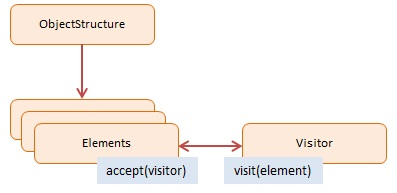
